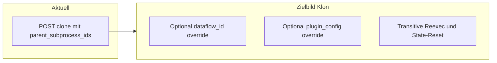

# API-DBDoc-Restructure-Plan (Artefakt)

Dieses Dokument ist die geforderte Entscheidungsgrundlage. **Aktueller Code-Stand:** `dflowp/api/app.py` (Legacy-Pfade `processes`/`subprocesses`/`events` GET) und `dflowp/api/kebab_routes.py` (Router `prefix="/api/v1"`, inkl. `pipelines`/`dataflows`/`dataflow-states`/`plugin-configurations`/`plugin-workers`, `POST /events`).

**Authentifizierung (alle Endpunkte):** Header `X-API-Key: <KEY>`. Beispiel unten: `export API_KEY=...` und `export BASE=https://api.dflowp.online`.

---

## 1. Endpunkte (vollständig)

| # | Methode | Pfad | Kurzbeschreibung | Quellmodul |
|---|---------|------|------------------|------------|
| 1 | POST | `/api/v1/datasets` | Dataset anlegen (data_ids **oder** rows) | `app.py` |
| 2 | GET | `/api/v1/data` | Data/Dataset-Liste (ohne `content`) | `app.py` |
| 3 | GET | `/api/v1/data/{item_id}` | Data/Dataset-Detail (mit `content` bei `data`) | `app.py` |
| 4 | POST | `/api/v1/data` | Data-Dokument anlegen (`doc_type=data`) | `app.py` |
| 5 | GET | `/api/v1/processes` | Pipeline-Liste (Zusammenfassung) | `app.py` |
| 6 | GET | `/api/v1/processes/{process_id}` | Pipeline-Detail (Mongo-nahes Dokument) | `app.py` |
| 7 | GET | `/api/v1/subprocesses` | Plugin-Worker-Liste (Legacy-Name „Subprozesse“) | `app.py` |
| 8 | GET | `/api/v1/subprocesses/{subprocess_id}` | Plugin-Worker-Detail | `app.py` |
| 9 | GET | `/api/v1/events` | Event-Liste; Query: `pipeline_id` und/oder `process_id` | `app.py` |
| 10 | GET | `/api/v1/events/{event_id}` | Event-Detail | `app.py` |
| 11 | POST | `/api/v1/processes/{process_id}/clone` | Pipeline klonen (aktuell: `ProcessCloneRequest`) | `app.py` |
| 12 | POST | `/api/v1/processes` | Pipeline anlegen (Body: `ProcessCreateRequest`) | `app.py` |
| 13 | POST | `/api/v1/processes/{process_id}/stop` | Pipeline stoppen | `app.py` |
| 14 | DELETE | `/api/v1/processes/{process_id}` | Pipeline-Dokument löschen | `app.py` |
| 15 | GET | `/api/v1/pipelines` | wie (5), primäre Bezeichnung | `kebab_routes.py` |
| 16 | GET | `/api/v1/pipelines/{pipeline_id}` | wie (6) | `kebab_routes.py` |
| 17 | POST | `/api/v1/pipelines` | wie (12), Body: `PipelineCreateRequest` | `kebab_routes.py` |
| 18 | POST | `/api/v1/pipelines/{pipeline_id}/stop` | wie (13) | `kebab_routes.py` |
| 19 | POST | `/api/v1/pipelines/{pipeline_id}/clone` | wie (11) | `kebab_routes.py` |
| 20 | DELETE | `/api/v1/pipelines/{pipeline_id}` | wie (14) | `kebab_routes.py` |
| 21 | GET | `/api/v1/plugin-workers` | wie (7) | `kebab_routes.py` |
| 22 | GET | `/api/v1/dataflows` | Dataflow-Liste (Zusammenfassung) | `kebab_routes.py` |
| 23 | GET | `/api/v1/dataflows/{dataflow_id}` | Dataflow-Detail | `kebab_routes.py` |
| 24 | POST | `/api/v1/dataflows` | Dataflow anlegen | `kebab_routes.py` |
| 25 | PUT | `/api/v1/dataflows/{dataflow_id}` | Dataflow ersetzen | `kebab_routes.py` |
| 26 | DELETE | `/api/v1/dataflows/{dataflow_id}` | Dataflow löschen | `kebab_routes.py` |
| 27 | GET | `/api/v1/dataflow-states` | Liste; optional `pipeline_id`, `dataflow_id` | `kebab_routes.py` |
| 28 | GET | `/api/v1/dataflow-states/{dataflow_state_id}` | State-Detail | `kebab_routes.py` |
| 29 | POST | `/api/v1/dataflow-states` | State anlegen | `kebab_routes.py` |
| 30 | PATCH | `/api/v1/dataflow-states/{dataflow_state_id}` | State-Update (nodes/edges/dataflow_state) | `kebab_routes.py` |
| 31 | DELETE | `/api/v1/dataflow-states/{dataflow_state_id}` | State löschen | `kebab_routes.py` |
| 32 | GET | `/api/v1/plugin-configurations` | Plugin-Konfig-Liste (Zusammenfassung) | `kebab_routes.py` |
| 33 | GET | `/api/v1/plugin-configurations/{plugin_configuration_id}` | Konfig-Detail | `kebab_routes.py` |
| 34 | POST | `/api/v1/plugin-configurations` | Konfig anlegen | `kebab_routes.py` |
| 35 | DELETE | `/api/v1/plugin-configurations/{plugin_configuration_id}` | Konfig löschen | `kebab_routes.py` |
| 36 | POST | `/api/v1/events` | Event manuell persistieren (ergänzt zu GET) | `kebab_routes.py` |

**Hinweis:** (5)–(6) und (15)–(16) bzw. (7)–(8) und (21) sind fachlich parallel; Pfade unterscheiden sich nur in der Benennung (`processes` vs `pipelines`).

---

## 2. Beispielaufrufe (curl) – pro Endpunkt

Gemeinsame Präambel:

```bash
export BASE="https://api.dflowp.online"
export H="X-API-Key: $API_KEY"
```

- **(1) POST /datasets** – Dataset aus Zeilen:

```bash
curl -sS -X POST "$BASE/api/v1/datasets" -H "$H" -H "Content-Type: application/json" \
  -d '{"id":"ds_example_001","rows":[{"title":"a"},{"title":"b"}]}'
```

- **(2) GET /data** – Liste, Filter wiederholter Query-Parameter:

```bash
curl -sS "$BASE/api/v1/data?page=1&page_size=20&doc_type=data&doc_type=dataset" -H "$H"
```

- **(3) GET /data/{item_id}**

```bash
curl -sS "$BASE/api/v1/data/ds_example_001" -H "$H"
```

- **(4) POST /data** – neues Data-Dokument:

```bash
curl -sS -X POST "$BASE/api/v1/data" -H "$H" -H "Content-Type: application/json" \
  -d '{"content":{"text":"hello"},"type":"input"}'
```

- **(5) GET /processes** bzw. **(15) GET /pipelines**

```bash
curl -sS "$BASE/api/v1/processes?page=1&page_size=20" -H "$H"
curl -sS "$BASE/api/v1/pipelines?page=1&page_size=20" -H "$H"
```

- **(6) GET /processes/{id}** bzw. **(16) GET /pipelines/{id}**

```bash
curl -sS "$BASE/api/v1/pipelines/PIPELINE_ID" -H "$H"
```

- **(7) GET /subprocesses** bzw. **(21) GET /plugin-workers**

```bash
curl -sS "$BASE/api/v1/subprocesses?page=1&page_size=20" -H "$H"
curl -sS "$BASE/api/v1/plugin-workers?page=1&page_size=20" -H "$H"
```

- **(8) GET /subprocesses/{id}**

```bash
curl -sS "$BASE/api/v1/subprocesses/WORKER_ID" -H "$H"
```

- **(9) GET /events**

```bash
curl -sS "$BASE/api/v1/events?page=1&page_size=20&pipeline_id=PIPELINE_ID" -H "$H"
# alternativ (Legacy-Param):
curl -sS "$BASE/api/v1/events?page=1&page_size=20&process_id=PIPELINE_ID" -H "$H"
```

- **(10) GET /events/{event_id}**

```bash
curl -sS "$BASE/api/v1/events/EVENT_MONGO_ID" -H "$H"
```

- **(11) POST /processes/{id}/clone** bzw. **(19) POST /pipelines/{id}/clone** – **aktuell** verlangt `ProcessCloneRequest` mindestens `parent_subprocess_ids` (min. 1 Eintrag) – reiner „Retry ohne Eltern“ existiert in diesem Schema so nicht; ein erweiterter Ablauf würde den Request-Body erweitern.

```bash
curl -sS -X POST "$BASE/api/v1/pipelines/PIPELINE_ID/clone" -H "$H" -H "Content-Type: application/json" \
  -d '{"parent_subprocess_ids":["PluginWorker1"],"new_process_id":null,"subprocess_config":null}'
```

- **(12) POST /processes** – Body: `ProcessCreateRequest` (`process_id`, `dataflow`, `subprocess_config`, …)

```bash
curl -sS -X POST "$BASE/api/v1/processes" -H "$H" -H "Content-Type: application/json" -d @body_process.json
```

- **(17) POST /pipelines** – `PipelineCreateRequest` mit `pipeline_id`/`plugin_config`

```bash
curl -sS -X POST "$BASE/api/v1/pipelines" -H "$H" -H "Content-Type: application/json" -d @body_pipeline.json
```

- **(13)/(18) POST .../stop**

```bash
curl -sS -X POST "$BASE/api/v1/pipelines/PIPELINE_ID/stop" -H "$H" -H "Content-Type: application/json" \
  -d '{"reason":"admin stop"}'
```

- **(14)/(20) DELETE**

```bash
curl -sS -X DELETE "$BASE/api/v1/pipelines/PIPELINE_ID" -H "$H" -w "\n%{http_code}\n"
```

- **(22) GET /dataflows**

```bash
curl -sS "$BASE/api/v1/dataflows?page=1&page_size=20" -H "$H"
```

- **(23) GET /dataflows/{id}** – siehe Abschnitt 3

- **(24) POST /dataflows**

```bash
curl -sS -X POST "$BASE/api/v1/dataflows" -H "$H" -H "Content-Type: application/json" \
  -d '{"dataflow_id":"df_manual","name":"dataflow","nodes":[],"edges":[]}'
```

- **(25) PUT /dataflows/{id}** – `dataflow_id` im Body = Pfad

```bash
curl -sS -X PUT "$BASE/api/v1/dataflows/df_manual" -H "$H" -H "Content-Type: application/json" \
  -d '{"dataflow_id":"df_manual","name":"dataflow","nodes":[...],"edges":[...]}'
```

- **(26) DELETE /dataflows/{id}**

```bash
curl -sS -X DELETE "$BASE/api/v1/dataflows/df_manual" -H "$H" -w "\n%{http_code}\n"
```

- **(27) GET /dataflow-states**

```bash
curl -sS "$BASE/api/v1/dataflow-states?page=1&page_size=20&pipeline_id=PIPELINE_ID" -H "$H"
```

- **(28)–(31)** – analog mit JSON-Bodyen aus `DataflowStateCreateRequest` bzw. PATCH-Body (siehe OpenAPI/Implementierung in `kebab_routes.py`).

- **(32)–(35)** – `plugin_configurations` analog.

- **(36) POST /events** (nur in Kebab-Router, nicht doppelt in `app`):

```bash
curl -sS -X POST "$BASE/api/v1/events" -H "$H" -H "Content-Type: application/json" \
  -d '{"pipeline_id":"P","plugin_worker_id":"W","event_type":"EVENT_COMPLETED"}'
```

---

## 3. Detail-API: Beispiel-Response-JSON (orientativ)

Die API gibt überwiegend **persistierte MongoDB-Dokumente** zurück (ggf. angereichert). Plätze in `{}` sind Platzhalter; `_id` typischer ObjectId-String; Timestamps Beispielwerte.

### 3.1 `GET /api/v1/data/{item_id}` (Data)

```json
{
  "id": "data_abc123",
  "doc_type": "data",
  "type": "input",
  "content": { "text": "…" },
  "timestamp_ms": 1777000000000,
  "timestamp_human": "…"
}
```

### 3.2 `GET /api/v1/data/{item_id}` (Dataset, verkürzt)

```json
{
  "id": "ds_001",
  "doc_type": "dataset",
  "data_ids": ["data_1", "data_2"],
  "timestamp_ms": 1777000000000
}
```

### 3.3 `GET /api/v1/pipelines/{pipeline_id}` bzw. `GET /api/v1/processes/{id}`

```json
{
  "_id": "…",
  "pipeline_id": "tiger_…_pipeline_proc",
  "process_id": "tiger_…_pipeline_proc",
  "software_version": "0.2.103",
  "input_dataset_id": "ds_…",
  "dataflow_id": "mig_df_…",
  "plugin_configuration_id": "mig_pcfg_…",
  "dataflow_state_id": "mig_dfs_…",
  "status": "completed",
  "timestamp_ms": 1776955953676
}
```

### 3.4 `GET /api/v1/subprocesses/{id}` bzw. inhaltlich gleiche Worker-Daten

```json
{
  "plugin_worker_id": "FetchFeedItems1",
  "pipeline_id": "…",
  "plugin_type": "FetchFeedItems",
  "subprocess_id": "FetchFeedItems1",
  "subprocess_type": "FetchFeedItems",
  "event_status": "EVENT_COMPLETED",
  "io_transformation_states": [],
  "timestamp_ms": 0
}
```

*(Hinweis: Geplante Umbenennung u.a. `pipeline_id` → `producer_pipeline_id` ist zum Zeitpunkt dieses Dokuments in der API noch nicht vollständig umgesetzt.)*

### 3.5 `GET /api/v1/dataflows/{dataflow_id}`

Aktuell u.a. `name` aus `DataflowCreateRequest` (Default `"dataflow"`). Die Wording-/Struktur in `nodes` hängt von gespeicherten Keys ab.

```json
{
  "dataflow_id": "df_001",
  "name": "dataflow",
  "nodes": [
    { "plugin_worker_id": "A", "plugin_type": "TypeA" }
  ],
  "edges": [ { "from": "A", "to": "B" } ],
  "timestamp_ms": 0
}
```

### 3.6 `GET /api/v1/dataflow-states/{dataflow_state_id}`

Aktuell: verschachteltes Muster inkl. `dataflow_state`, `nodes` mit I/O-States. **Zielbild** (siehe Restructure-Backlog): kompakte Referenzen pro Plugin-Worker + Quality-Zusammenfassung, Sortierung entlang DAG (Blätter zuerst).

```json
{
  "dataflow_state_id": "dfs_…",
  "pipeline_id": "…",
  "dataflow_id": "…",
  "nodes": [ { "plugin_worker_id": "…", "plugin_type": "…", "event_status": "…" } ],
  "edges": [ { "from": "…", "to": "…" } ],
  "dataflow_state": { "nodes": [ … ], "edges": [ … ] },
  "timestamp_ms": 0
}
```

### 3.7 `GET /api/v1/plugin-configurations/{id}`

```json
{
  "plugin_configuration_id": "pcfg_…",
  "by_plugin_worker_id": {
    "FetchFeedItems1": { "key": "value" }
  },
  "timestamp_ms": 0
}
```

### 3.8 `GET /api/v1/events/{event_id}`

Erwartet persistente Mischung aus neuen und Legacy-Feldern (Engine setzt u.a. beides). Konsolidierte Wunschbenennung (nur `pipeline_*` / `plugin_worker_*` / Replica-ID, snake_case) ist im Backlog abzugleichen.

```json
{
  "_id": "…",
  "pipeline_id": "…",
  "plugin_worker_id": "…",
  "process_id": "…",
  "subprocess_id": "…",
  "subprocess_instance_id": 1,
  "event_type": "EVENT_COMPLETED",
  "event_time": "2026-04-26T12:00:00Z",
  "timestamp_ms": 0
}
```

---

## 4. Abgleich mit geplanten Änderungen (Kurz)

- **Dataflow-Dokument:** `name` entfernen/ersetzen; vereinheitlichte Keys `plugin_worker_id`/`plugin_type` in API und Doku (kein Subprozess-Wording im Response).
- **DataflowState:** neues, schlankes Modell (Plugin-Worker-Referenzen + Status + Quality-Aggregat); Sortierung der Worker-Liste für API: topologisch **Blätter zuerst, Root zuletzt** (Reihenfolge der Ausführung umkehren = „zuletzt ausgeführt zuerst“).
- **Plugin-Worker-Dokument:** `producer_pipeline_id` (statt/ergänzend zu `pipeline_id` im Sinne der aktuellen Semantik); zusammengesetzter Schlüssel `(producer_pipeline_id, plugin_worker_id)` klar dokumentieren.
- **Events API-Response:** einheitlich snake_case, Begriffe Pipeline / Plugin-Worker / Replica-ID; Legacy-Felder ggf. deprecaten oder parallel nur für Migration.
- **Klon/Retry:** heute `ProcessCloneRequest` **erzwingt** `parent_subprocess_ids` (min. 1) – deckt „reiner Retry ohne Vorgabe“ / optionale `dataflow_id` / differentielle Plugin-Config mit Transitiv-Reset **noch nicht** ab; dafür sind neue/erweiterte Schemas, Repository-Logik (`copy_pipeline_with_reexecution` und Folgeoperationen) und ggf. eigene Endpunkte oder Rückwärtskompatibilität nötig.



---

## 5. Repo-Ablage

- Diese Datei: `docs/API-DBDoc-Restructure-Plan.md` (Volltext Endpunktliste, curl, Beispiel-JSON, Backlog-Abgleich).
- In der **OpenAPI-Beschreibung** der laufenden API (`/docs`, `/redoc`, `/openapi.json`) ist auf diese Referenz hingewiesen (siehe `dflowp/api/app.py`).

---

## 6. Offene Rückfragen (für präzise Implementierung, optional)

- Soll die **Legacy-Route** `GET /api/v1/subprocesses` dauerhaft bleiben oder nur `plugin-workers`? (Funktional aktuell identische Daten.)
- Exakte **JSON-Form** für DataflowState-Quality: festes Schema `quality: { min, max, avg, median }` pro Worker oder pro Aggregat über alle Outputs des Workers?
